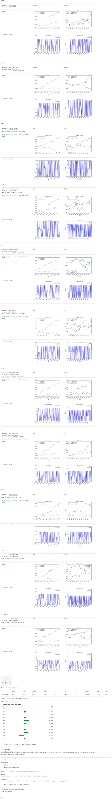

# Q-learning trader
A technical q trader on SPY given macd.

## run
`python teststratgy.py`

## structure
QLearner.py: an independent tabular (dyna)q-learner.

StrategyLearner.py: Build upon Qlearner.py to learn the trading strategy

testStrategy.py: train and test the StrategyLearner

util.py: some helper functions for the model

## experiment result

please see [this link](https://www.evernote.com/shard/s120/sh/00a11079-5e8d-4243-87e5-5daaf8565836/ebafa9649081c29dc98d27cb7c3a8a18)

or the evernote screenshot below:

